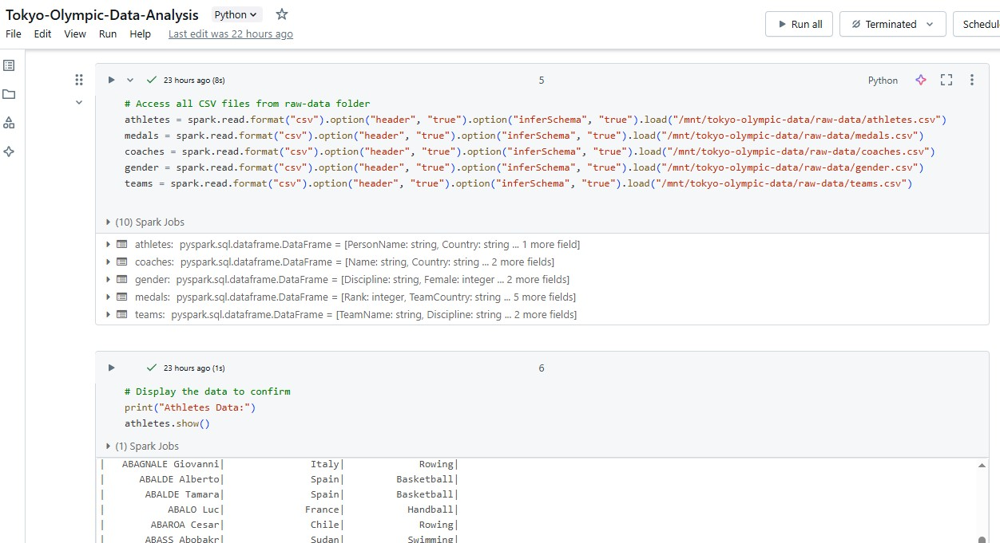
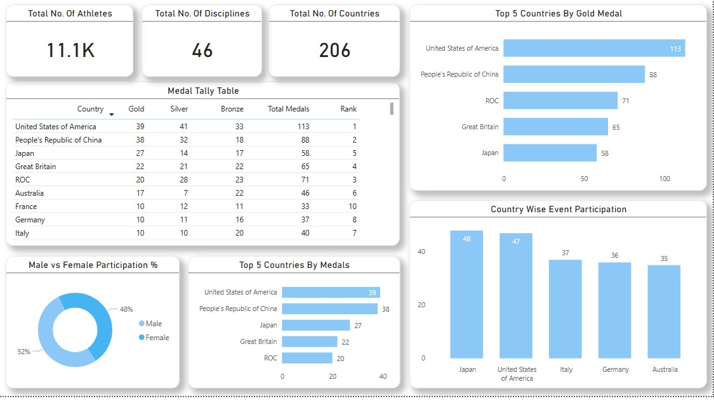

# Tokyo_Olympics_Data_Analysis

🚀 Project: Tokyo Olympic Data Analysis 🏅
I'm excited to share one of my end-to-end data analytics projects where I explored cloud-based data integration and visualization using the Tokyo Olympics dataset!

🎯 Project Objective -
To perform end-to-end data analysis on Tokyo Olympic data using cloud platforms and create a meaningful and interactive dashboard in Power BI.

🛠️ Tools & Technologies Used -
1. Azure Cloud Services (Resource Group, Storage Account, Data Factory, Databricks)
2. GitHub (for code and data repository)
3. Python (for data cleaning and transformation in Databricks)
4. Power BI (for dashboard creation and visualization)

Data Transformation Script :
  

.

Power BI Report :
   

.

[See Full Dashboard Here!](https://app.powerbi.com/reportEmbed?reportId=fd0b4d10-367c-4257-9fb9-fabc9d5e948a&autoAuth=true&ctid=df8679cd-a80e-45d8-99ac-c83ed7ff95a0)

.

🔄 Project Process -
📥 Data Source: Downloaded the Tokyo Olympics dataset from Kaggle.

🌐 Version Control: Uploaded the dataset and scripts to a GitHub repository.

☁️ Azure Setup:
1. Created a Resource Group and a Storage Account.
2. Inside the container, created two folders: Raw Data and Cleaned Data.

🔁 Data Ingestion:
1. Used Azure Data Factory with Copy Data activity to fetch data from GitHub.
2. Set up Linked Services and executed the pipeline to load data into the Raw Data folder.

🧠 Data Cleaning & Transformation:
1. Created Databricks resource.
2. Mounted the storage account using Python script and access key.
3. Cleaned and transformed the data, then saved it into the Cleaned Data folder.

📊 Data Visualization:
1. Connected Power BI to the storage account using primary endpoint.
2. Validated and analyzed the data.
3. Created an interactive Power BI dashboard and published it to Power BI Service and GitHub.

📊 Key Insights from Tokyo Olympic Data Analysis

1. Total Participation Overview
a. Total Athletes: Approximately 11,100 athletes participated in the Tokyo Olympics.
b. Total Disciplines: The event featured 46 distinct disciplines.
c. Participating Countries: Athletes from 206 countries took part in the games.

2. Gender Participation
Male Participation: 52%
Female Participation: 48%
There was a 4% higher participation rate among male athletes compared to female athletes, highlighting a relatively balanced gender representation.

3. Top Countries by Total Medals Won 🏅
United States - 113
China- 88
ROC- 71
Great Britain- 65
Japan- 58

5. Top Countries by Gold Medals 🥇
United States - 39
China- 38
Japan- 27
Great Britain- 22
Russian Olympic Committee (ROC)- 20

7. Top Countries by Event Participation
Japan: Participated in 48 events – the highest among all countries.
USA: Participated in 47 events
Italy: 37 events
Germany: 36 events
ROC: 34 events

